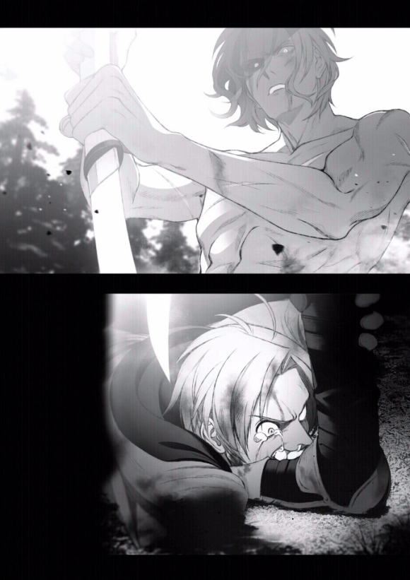

# 家人

这时，我突然想起往事。
自己成了家里蹲以后，大哥曾来到我的房间。

那时，他对我讲了各式各样的大道理。例如人生总是会碰上逆境，世界上多得是遭遇比我更惨的人。现在或许很痛苦，但是一旦逃避就会一直逃避下去，到时会更加痛苦。还有暂时不上学也没关系，总之和他一起去吃个饭吧……类似这样的发言。

我在内心对大哥嗤之以鼻。也没有开口回应，而是彻底无视他的存在。 

即使如此，大哥还是继续待在我身边。他一直看著我，眼里带著想要说些什么的神色。我认定这样的家伙不可能明白自己的感受，直到最后都全面拒绝。 ……我现在的心情，就是大哥当时的心情吗？

面对毫无反应的我，大哥也保持沉默。持续几个小时之后，他离开我的房间。 后来，大哥再也没有和我接触。我不知道他在那件事之后有什么想法。

只是大哥自己没有来，却来了各式各样的人。或许……那些人都是大哥安排的吧。不过到头来，我还是没把那些家伙的言论听进耳里。

……我想要是自己现在离开，就再也回不来了。诺伦也会继续闭门不出。所以我不能走。

****

> 这里中间有一段妹妹自己的想法独白
>
> 他看起来很不安。感觉跟爸爸很像，是一种能让我安心的脸孔。很像也是理所当然，因为他和爸爸是父子。
> 　　
> 「诺伦，真是抱歉。你来到这里以后，一直很痛苦吧？」
> 　　
> 哥哥喃喃开口。
> 　　
> 「我啊，实在不太了解你……就算演变成这种情况，我还是不知道该怎么做才好。」
> 　　
> 他很不安地说了这些话。这个样子，让我觉得看到爸爸的身影。
> 　　
> 「……」
> 　　
> 接下来，哥哥都没有动。
> 　　
> 他一直用不安表情看著我，却坚持坐在椅子上没动。如果是爸爸，一定会没有任何顾虑地过来抱住我；如果是瑞杰路德先生，大概会把手放到我头上。
> 　　
> 可是，哥哥却没有靠近我。
> 　　
> 「啊……」
> 　　
> 我明白为什么会这样了。
> 　　
> 哥哥是没办法靠近，因为他怕会被我拒绝。
> 　　
> 一想通这件事，很不可思议的，我突然觉得内心整个开朗起来。
> 　　
> 对哥哥的厌恶感不再出现，也不再觉得他很可怕，因为哥哥和爸爸很像。
> 　　
> 我想哥哥他一定……绝对不会打我，而且以后也绝对不会再对爸爸动手。
> 　　
> 「……呜呜……」
> 　　
> 自己无论如何，都必须原谅哥哥。
> 　　
> 「呜……呜呜……」
> 　　
> 等我回过神时，眼泪已经滴滴答答往下掉，不断颤抖的喉咙深处也发出啜泣声。
> 　　
> 「对不起，哥哥……对不起。」
> 　　
> 哥哥以战战兢兢的态度来到我身边坐下，然后慢慢地举起手放到我头上，把我抱进怀里。他的手很温暖，胸膛既宽广又结实。
> 　　
> 而且，还有很像爸爸的味道。
> 　　
> 那一天，我在哥哥怀里哭了一整夜。

****

结果，我没能做出任何行动。 

诺伦什么都没告诉我。我不知道她内心有什么不满什么疙瘩，也不清楚诺伦真正的想法。

她只有在我面前哭了一场，然后在哭完之后喃喃说了一句：「我没事了」，就只是这样。 不过，她一脸如释重负的样子。 还愿意正面看著我的双眼。 

这种态度让我没来由地松了一口气，觉得已经不要紧了。 所以我把接下来的事情交给希露菲处理，自己离开诺伦的房间。 

从隔天起，诺伦变开朗了。

并不是哪里有什么明确的变化。只是彼此在走廊上相遇时，她会对我打个招呼说：「哥哥，早安」的程度。我们之间很少对话，也不会随便腻在一起。被人拿来和我比较的状况应该毫无改变，不过诺伦似乎已经不再介意。

我之前无法理解诺伦，所以什么都没办法说，也什么都没办法做。 真的很不中用。我一直以为自己很清楚茧居族的心情，对于那种凡事都做不好的家伙也能有同理心。结果实际碰上这种事之后，却表现出这种丑态。

我猜……虽然只是推测，不过诺伦大概已经整理好自己的心情。 她调整好各种情绪想法，克服了现在的状况。 真是了不起的孩子。 保罗和爱夏或许都认为诺伦很笨拙。 我并不那样认为。因为至少，她已经达成我生前没能办到的事情。

如果我生前能跟诺伦一样把自己理出头绪，是不是会有什么不同？是不是就能够避免被原本很温柔的大哥痛殴的未来？

我不知道过去会不会改变。自己当时的状况和诺伦不同，就算能够整理好心情，也不确定是否能踏向外界。而且转生来到异世界之后，要是没有遇到洛琪希，我想自己一定会继续当个家里蹲。 基本上，事到如今也不可能回到过去。

过去无法改变，已经扭曲恶化的骨肉亲情再也无法挽回。不管是大哥的真正想法还是其他任何事情，都埋藏在黑暗之中再也无法厘清。 ……但是，我总觉得长久以来一直卡在喉咙里的某种东西终于取出来了。

如果七星哪一天真的能够回到原本的世界，到时候，我就拜托她给大哥带个口信吧。 要谢谢大哥那时为作弟弟的我担心，还有……要说一声对不起。

# 能力与责任

我再度仔细观察她，所谓想去的地方应该是指贝卡利特大陆吧。 所以我又看了看诺伦。诺伦还很小，真的很小，才十岁而已。 

「……」
她准备的行李是不是根本没有把必要的东西备齐？看起来好像有带钱，但是她知道该怎么用吗？有把路线调查清楚吗？有避开危险的手段吗？她会不会才踏出这个城镇，就立刻被绑票集团抓走？ 

「诺伦，你办不到。」 

「可是哥哥……爸爸和妈妈他们碰上困难了啊！」

诺伦那盈满泪水的双眼转向我。 

「为什么……哥哥你为什么不去救他们！」 

她问我为什么。当然是因为我的孩子要出生了，这里有我的家人。 

「哥哥你明明非常强，也有能力应付旅程！为什么却……」

我确实有能力应付旅程。虽然不敢说比得上艾莉娜丽洁，但是我也曾以冒险者身分度过五年。 拥有不少相关的知识和诀窍。即使比上不足，也还算是相当有能力吧。 如果是现在，就算没有瑞杰路德，或许我也有办法闯越魔大陆。 

「……」

没错，我可以办到。虽然我一直在去或不去这两个选项中犹豫，然而我并不是像诺伦这样即使想去也去不了。自己拥有能力，从这里往返贝卡利特大陆的能力。正因为如此，基斯才会寄信向我求援，不是寄给别人，而是寄给我。 

「……诺伦，我明白了。」

「哥……哥哥……？」 

照顾希露菲这件事，有其他人可以帮我做。但是，救援行动非得我自己去才行。 除了我以外，没有别人。没有其他人能够闯越贝卡利特大陆，前往迷宫都市拉庞，然后解决在那里发生的问题。

# 父亲之死

如果当作打倒它的代价是只有牺牲了左手，说不定还算是便宜。 要不是保罗在千钧一发之际救了我，自己很有可能已经丧命。

「……谢谢您救了我一命，父亲。」 

我回头寻找保罗的身影。 结果却没有回应，所有人都保持沉默。 

艾莉娜丽洁原地呆站。 塔尔韩德一言不发。 洛琪希摀著嘴巴。 在他们身后，可以看到满脸苍白的基斯正跑向这里。 

保罗没有回答。 

「……父亲？」 

顺著所有人的视线看去，我发现保罗倒在地上。 对，他脸朝上躺著。 可是，不只是躺在那里而已。

保罗的眼神呆滞，意识不明。而且…… 没有下半身。 

「……咦？」 

我无法理解眼前的光景。 

「咦？」 

不，这样讲不太对。我知道发生了什么事。 没错，自己不是亲眼看到了吗？ 因为九头龙的最后一颗头朝著我这边冲来，所以保罗把我踢飞。

为了把一个人踢离原本位置，必须使出全力狠狠一踢才行。而且我已经成人，如果想全力踢我，必须摆出让腰部往前突出的姿势。 一般来说，踢人之后会因为反作用力而后退。

然而保罗是这个世界的剑士，能力优秀，肌肉发达，还能够身缠斗气。

换句话说，他即使把我踢了出去，自己的位置也可以保持不动。 

所以……也就是说……他停在我原本所在的位置，这就代表……不，我不想理解。 这就代表…… 

「啊……为什么？」 这句话脱口而出的瞬间，保罗的眼睛突然动了，和我视线相对。 

「…………」

保罗什么话都没说。他只是动了动嘴角，像是终于放心。然后呼出一口气，彷佛总算放松。

接著，无力地吐出一口鲜血…… 

最后，他的双眼失去光彩。 

保罗他……死了。

***

那天晚上，我作了个梦。

在梦中，我恢复成以前的模样……一个肥胖自卑的尼特族。 但是，人神没有出现，也没有前往白色的房间。 这是前世的记忆。没错，是前世的梦。 我无法判断确切时间，不过对眼前光景还有印象。 是家里的起居室……前世的家。

梦境里，前世的双亲正待在起居室商量关于我的事情。 或许因为这是一场梦，所以我听不到声音。然而很不可思议的是，我可以明白他们是在讨论自己的事情。

那个时候的双亲是不是在担心我？

结果，我连他们的死因都不知道，就离开了那个世界。因为两人同时死亡，我想应该不是生病。是意外吗？该不会是自杀吧？ 他们在临终的时候，对我有什么想法呢？对我这个厚颜无耻的尼特族抱著什么样的感觉呢？大概觉得焦急，也觉得丢脸吧？

我不知道真相是什么。 

母亲偶尔还是会来看看我的情况，父亲从某个时期之后就再也没说过任何话。 他们死去时，脑中曾经闪过我的事情吗？ 至于我自己……我连葬礼都没参加，是在做什么呢？ 也没有帮双亲处理后事，到底是去做什么了？

为什么自己连葬礼都没有出席？ 因为我害怕。明明双亲死了却却毫不伤心的我，害怕别人的眼神。 害怕那种像是在看人渣尼特族的眼神。害怕敌意，轻蔑。 

当然不只是因为那样，我不是那种老实的家伙。实际上，那时候的我对双亲的死根本不觉得有什么好悲伤。

我对双亲的感情并没有深厚到会为他们感到悲伤的程度。 比起悲伤，担心自己往后该怎么办和觉得事情不妙的心情反而更加强烈。我连自身的将来都无法好好正视。

我不是想要为自己辩护，不过我还是认为当时的反应无可厚非。毕竟在那种走投无路的状态下，一旦失去最后的藏身处，一旦还没下定决心就被丢进茫茫大海中，不管是谁都会想要逃避一下现实。

我确实感到后悔，但是我没办法责备当时的自己。

可是，至少……是不是至少该参加葬礼会比较好呢？ 

虽然我不确定当时的自己会不会因为那样而产生什么想法，不过是不是至少该看一下双亲的遗容？是不是至少该帮他们处理一下后事才对？ 

保罗他……他的遗容是什么模样？

他并没有露出满足的表情。但是，嘴角带著总算松了一口气的微笑。 

保罗那家伙，最后是想说什么呢？ 

我前世的双亲，又是带著什么表情死去？ 

自己为什么没有去看一下呢？ 

我好想现在回去，去看看双亲的脸孔。

# 挣扎的守护

让人不寒而栗的视线。我已经没有铠甲。要是不逃的话，会被杀掉。在那之前，右手，我的右手在哪？ 

「咕啊！」 

……当我会意过来时已经被踹飞了。一股宛如要将身体四分五裂的痛楚袭击全身。

我倒卧在地，当我想要呼吸空气而翻过身体时，胸部遭到狠狠一踩。 

「呜咕……」

呻吟声从喉咙深处挤出。 火烫的脖颈被冰冷的东西抵住。 仔细一看，奥尔斯帝德的剑就摆在眼前。 

我会死吗？没有赢过他，我会……就这样死去吗？

「还以为是谁，原来是你啊，鲁迪乌斯·格雷拉特。我听说你现在正过著幸福的生活，为什么要觊觎我的性命？」 

奥尔斯帝德似乎不打算马上杀我。 是因为他曾放过我一次，或者是判断我已经没有战斗能力？ 

「是人神，说的……」

「……哼，你果然是人神的使徒啊。死吧。」

奥尔斯帝德将脚从我胸口移开，将剑高高举起。 

「人神说，你打算毁灭这个世界……我的后代，会协助你，杀死人神……」 

「什么？」 奥尔斯帝德停下动作。 

「人神说，他想要阻止世界遭到毁灭，才会和你战斗。」

「……」 

「所以，他说只要杀了你，就愿意，放过我的孩子，放过我的家人……」 

我倒卧在地，缠住奥尔斯帝德的脚。 然后，用头磨蹭脚部大声叫喊。 我现在……只能这么做了。

「求求你。请你不要毁灭世界。就算杀了我也没关系。请你不要夺走我的孩子，夺走未来。求求你。这是我第一次。我第一次，觉得自己是这么地幸福。求求你。请你……放弃寻找人神。求求你……」 泪水夺眶而出。

我既无力，又狼狈。实在太难看了。

我到底在干嘛啊？ 

「……办不到。」 

听到这句话的瞬间，我狠狠咬住奥尔斯帝德的脚。 

「呼咕唔唔唔啊啊啊！」 

我用牙齿咬著，并举起喷出鲜血的右手，把剩余的所有魔力注入到失去拳头的手臂里，试图一口气爆发出来。

就算同归于尽，我也要杀了这家伙。

****

对著露出疑惑表情的鲁迪乌斯，奥尔斯帝德继续说下去。 

「背叛人神，跟随我吧！」 

听到这句话后立即做出反应的是这两个人。 

「别说梦话了！」 「鲁迪，不可以！」 艾莉丝和希露菲很肯定奥尔斯帝德在撒谎。

没有根据。但是却如此坚信。基列奴和洛琪希虽然保持沉默，不过她们也认为奥尔斯帝德在打什么坏主意，这句话背后另有隐情。 

「答应的话，你对我发动奇袭一事可以付诸流水，你被砍下的手臂伤势也由我来治疗！」 

「……」 

但是，鲁迪乌斯不同。

他察觉奥尔斯帝德的声音隐含了某种东西。注意到他喉咙深处的颤抖。 他发现了这点。 

「只要……得到我的龙神之庇护，人神应该也没有办法轻易对你出手。」 

鲁迪乌斯的眼中，混杂著怀疑与犹豫的光芒。 

「现在这些对话，也不会传到他的耳中！」 「……」

「假如你并非心甘情愿服从人神，这应该是个不错的提议！」

「…………」 

「选择吧！鲁迪乌斯·格雷拉特！是要跟随人神，在我的手中失去一切！还是要跟随我，一同与人神战斗！如果是你，如果是我的诅咒无法产生作用的你，应该能以自己的意志做出选择！」

鲁迪乌斯和奥尔斯帝德的眼神交会。 鲁迪乌斯就这样缓缓地吐了一口气，像是在确认著什么似的目不转睛地盯著他的脸。 试图看到藏在奥尔斯帝德表情深处的真相。 

当然，鲁迪乌斯不可能看得到那种东西，就这样过了几秒钟的时间。 

「鲁迪？」

鲁迪乌斯摇摇晃晃地松开了洛琪希的手。 尽管步履蹒跚，他依旧缓慢走著，靠在基列奴的肩上，以踉跄的步伐抱住希露菲，穿过艾莉丝的身旁。 最后倒在奥尔斯帝德的脚边。 

他双膝跪地，就这样抬头仰望奥尔斯帝德。

「真的，有从人神手中，保护我家人的方法吗……？」 

「有！尽管那家伙拥有强大的未来视，但不是看得见全部，也并非全知全能。」 

「那个方法，绝对……绝对不要紧吗？」 

「……不是绝对。毕竟我也没有完全掌握那家伙的力量。」

奥尔斯帝德没有断言。他没对鲁迪乌斯说没问题，也没有要他放心。

鲁迪乌斯用寻求救助的目光看著奥尔斯帝德。 

鲁迪乌斯眼角的泪水，到底是基于什么想法才浮现的呢？ 

只不过，鲁迪乌斯做出了决断。 

「……我……要臣服在龙神（你）麾下。请你救救我。」

那天，鲁迪乌斯·格雷拉特成为了龙神的部下。
